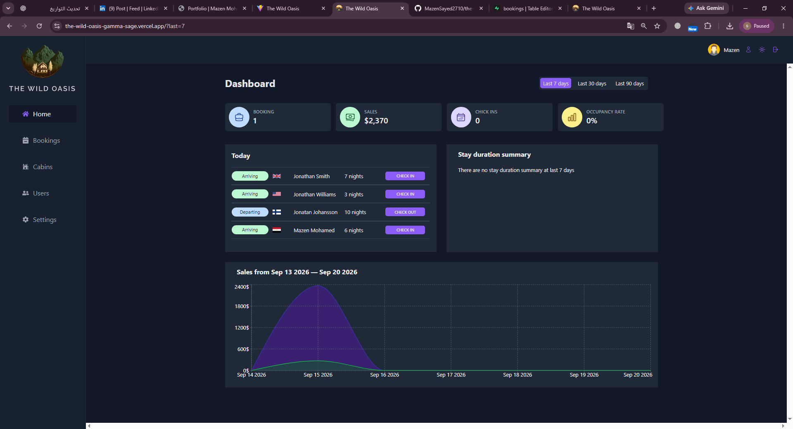
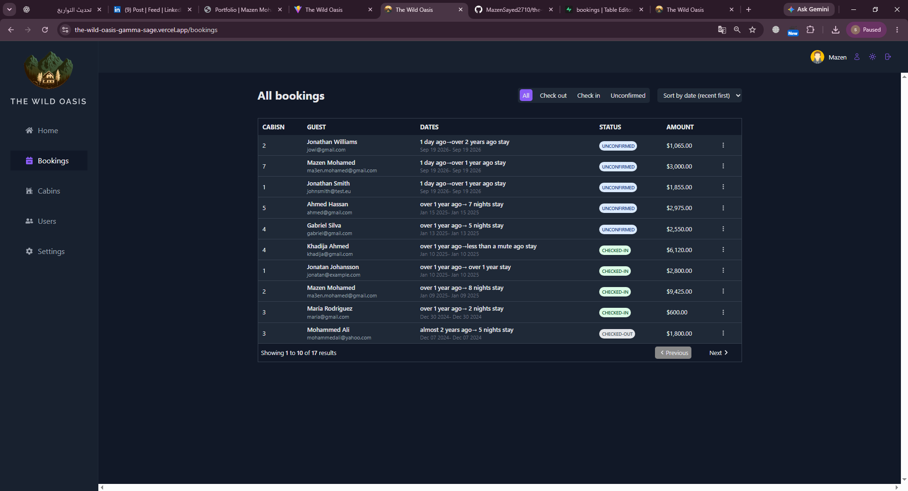
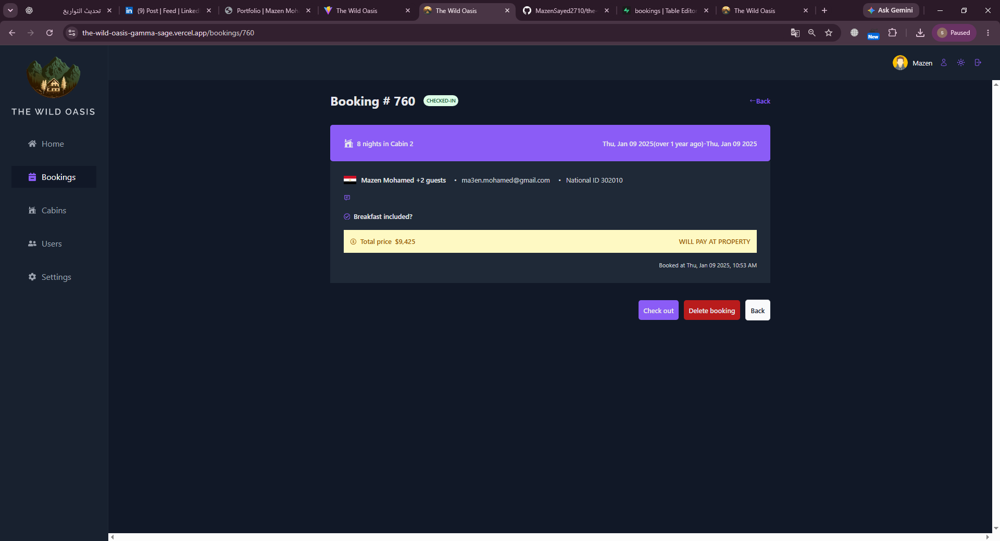
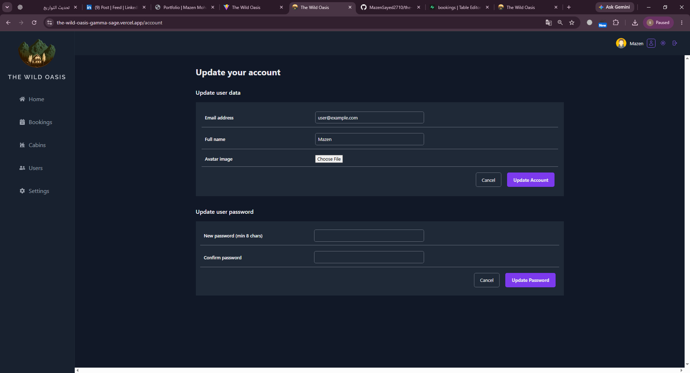

# 🏨 The Wild Oasis

A hotel management dashboard for managing bookings, cabins, guests, and
daily hotel operations from a single interface.

## ✨ Features

- 🔐 Authentication with Supabase
- 📅 View, filter, and sort hotel bookings
- 👤 View guest and reservation details
- ✅ Guest check-in and check-out workflows
- 🏡 Create, update, and manage cabins
- 💰 Manage cabin pricing and discounts
- 📊 Dashboard with sales, bookings, and occupancy statistics
- ⚙️ Hotel settings and account management
- 🌙 Dark mode
- 📱 Responsive admin interface

## 🛠️ Tech Stack

### Frontend

- React
- Vite
- Tailwind CSS
- React Router

### State & Data

- TanStack React Query
- React Hook Form

### Backend

- Supabase

### Additional Tools

- Recharts
- date-fns
- React Hot Toast
- SweetAlert2
- React Icons

### Dashboard



### Bookings



### Booking Details



### Account



## 🚀 Getting Started

### 1. Clone the repository

Clone this repository and open the project folder in your terminal.

### 2. Install dependencies

```bash
npm install
```

### 3. Configure environment variables

Create a `.env.local` file in the project root and add:

```env
VITE_SUPABASE_URL=
VITE_SUPABASE_KEY=
```

> Never commit environment variable values or secret keys to the
> repository.

## ▶️ Running Locally

Start the development server:

```bash
npm run dev
```

Then open the local Vite development URL, typically:

```text
http://localhost:5173
```

To create a production build:

```bash
npm run build
```

## 🔗 Live Demo

https://the-wild-oasis-dashboard.vercel.app/login

## 👤 Author

**Mazen Mohamed**\
Frontend Developer specializing in React and Next.js.
